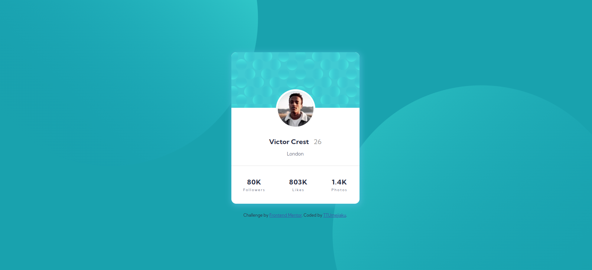
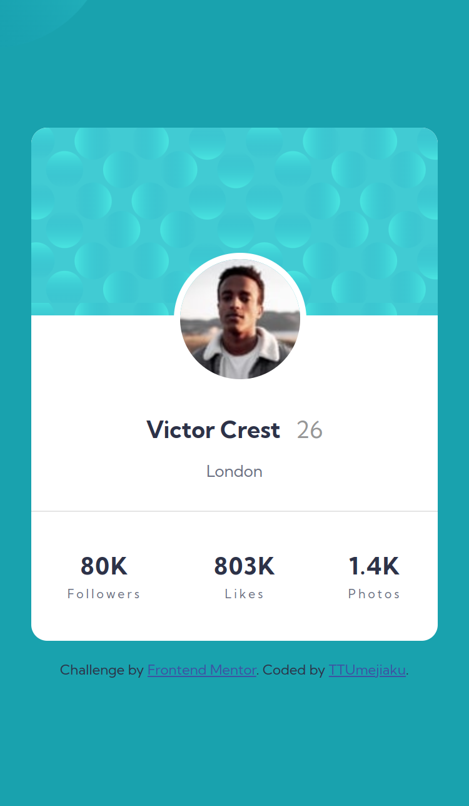

# Frontend Mentor - Profile card component solution

This is a solution to the [Profile card component challenge on Frontend Mentor](https://www.frontendmentor.io/challenges/profile-card-component-cfArpWshJ). Frontend Mentor challenges help you improve your coding skills by building realistic projects.

## Table of contents

- [Overview](#overview)
  - [The challenge](#the-challenge)
  - [Screenshot](#screenshot)
  - [Links](#links)
- [My process](#my-process)
  - [Built with](#built-with)
  - [What I learned](#what-i-learned)
- [Author](#author)

## Overview

### The challenge

- Build out the project to the designs provided

### Screenshot




### Links

- Solution URL: (https://github.com/TTUmejiaku/profile-card-component.git)
- Live Site URL: (https://ttumejiaku-profile-card-component.netlify.app/)

## My process

### Built with

- Semantic HTML5 markup
- CSS custom properties
- Flexbox
- Mobile-first workflow

### What I learned

- How to apply and style multiple background images.

```css
body {
  background: url(./images/bg-pattern-top.svg) top -350px left -100px no-repeat,
    url(./images/bg-pattern-bottom.svg) bottom -300px right -100px no-repeat;
}
```

## Author

- Frontend Mentor - (https://www.frontendmentor.io/profile/TTUmejiaku)
- Twitter - (https://www.twitter.com/TTUmejiaku)
